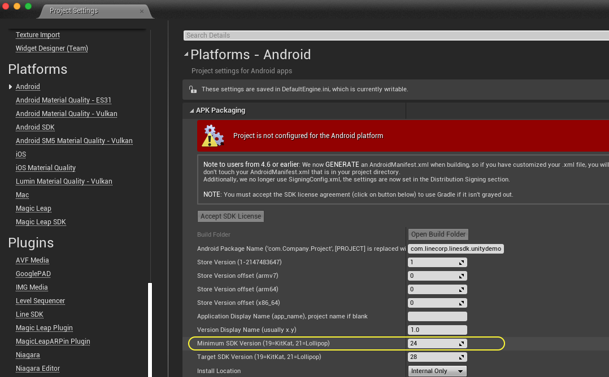
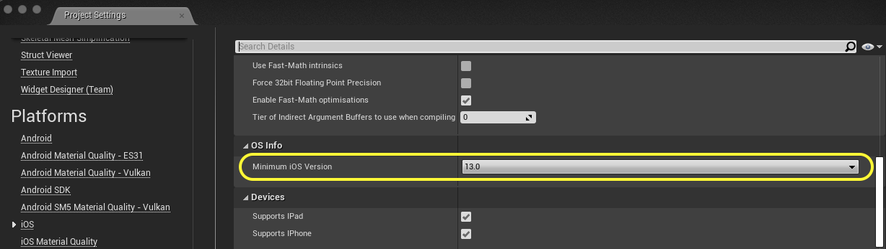

[](document/LineSDKforUnrealEngine.md)
[](document/Blueprints.md)


   


# [⚠️ UNOFFICIAL] LINE SDK for Unreal Engine

[](https://github.com/line/line-sdk-android)
[](https://github.com/line/line-sdk-ios-swift)
[](https://github.com/line/line-sdk-unity)

Implemented SDK versions:

- [`com.linecorp.linesdk:linesdk:5.10.1`](https://mvnrepository.com/artifact/com.linecorp.linesdk/linesdk/5.10.1)
- [`LineSDKSwift`](https://cocoapods.org/pods/LineSDKSwift) `v5.11.2`

## Overview

This repo contains the _**⚠️ UNOFFICIAL** LINE SDK for Unreal Engine_. It allows you to use LINE Login and LINE API in your Unreal Engine games easier.

## Features

The LINE SDK for Unreal Engine provides the following features.

### User authentication

This feature allows users to log in to your service with their LINE accounts. With the help of the LINE SDK for Unreal Engine, it has never been easier to integrate LINE Login into your app. Your users will automatically log in to your app without entering their LINE credentials if they are already logged in to LINE on their Android/iOS devices. This offers a great way for users to get started with your app without having to go through a registration process.

### Utilizing user data with OpenID support

Once the user authorizes, you can get the user’s LINE profile. You can utilize the user's information registered in LINE without building your user system.

The LINE SDK supports the OpenID Connect 1.0 specification. You can get ID tokens that contain the user’s LINE profile when you retrieve the access token.

## Using the SDK

### Prerequisites

* Android `minSdkVersion` set to 24 or higher (Android 7.0 or later).
* iOS 13.0 or later as the deployment target.
* Unreal Engine 4.23 or later.

> [!NOTE]
> * Setting up Android minimum SDK version
>   
>   |  |
>   | --- |
>
> * Setting up minimum iOS version
>
>   |  |
>   | --- |

To use the LINE SDK with your game, follow the steps below.

* Create a channel.
* Integrate LINE Login into your Unreal Engine project.
* Make API calls from your game using the SDK or from the server-side.

For more information, refer to the [[⚠️ UNOFFICIAL] LINE SDK for Unreal Engine](document/LineSDKforUnrealEngine.md) guide.

### Trying the starter app

To have a quick look at the features of the LINE SDK, try our starter app by following the steps below:

1. Clone the repository.

    ```git clone https://github.com/pokeum/line-sdk-unreal```

2. Open the Unreal Engine project under "Line_SDK_Unreal" folder.

3. Package project to either Android or iOS, and deploy it to your device and run.
