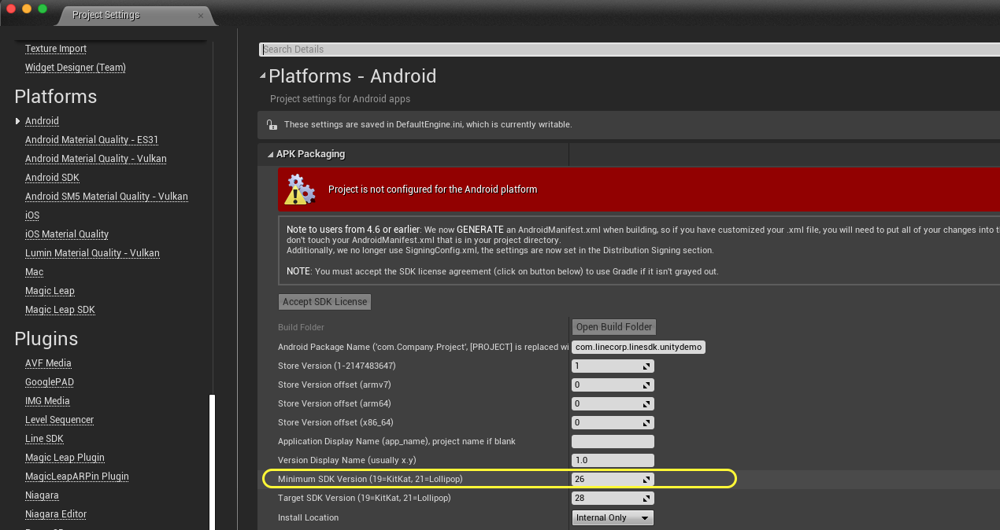

   

# [UNOFFICIAL] LINE SDK for Unreal

[](https://github.com/line/line-sdk-android)
[](https://github.com/line/line-sdk-unity)

Implemented SDK versions:

- [LINE SDK v5 for Android (Ver 5.10.1)](https://github.com/line/line-sdk-android/releases/tag/v5.10.1)

## Overview

This repo contains the _**UNOFFICIAL** LINE SDK_ for Unreal Engine. It allows you to use LINE Login and LINE API in your Unity games easier.

## Features

The LINE SDK for Unreal Engine provides the following features.

## Troubleshooting

### Android

#### 1. `uses-sdk:minSdkVersion` build error

> [!NOTE]
> Set minSdkVersion to `26` or above.
> |  |
> | --- |

#### 2. Using `AndroidX`

>  [](https://developer.android.com/jetpack/androidx)
> 
> In Unreal Engine v4.23 or later and v5.1.0 or earlier, write the following Unreal Plugin Language code.
> 
> ```xml
> <?xml version="1.0" encoding="utf-8"?>
> <root xmlns:android="http://schemas.android.com/apk/res/android">
> 
>     <gradleProperties>
>         <insert>
>             android.useAndroidX=true
>             android.enableJetifier=true
>         </insert>
>     </gradleProperties>
> 
>     <baseBuildGradleAdditions>
>         <insert>
>             allprojects {
> 
>                 def classMap = [
>                     'android.support.annotation': 'androidx.annotation',
>                     'android.support.v4.app.ActivityCompat': 'androidx.core.app.ActivityCompat',
>                     'android.support.v4.app.NotificationCompat': 'androidx.core.app.NotificationCompat',
>                     'android.support.v4.app.NotificationManagerCompat': 'androidx.core.app.NotificationManagerCompat',
>                     'android.support.v4.content.ContextCompat': 'androidx.core.content.ContextCompat',
>                     'android.support.v4.content.FileProvider': 'androidx.core.content.FileProvider',
>                     'android.support.v13.app.FragmentCompat': 'androidx.legacy.app.FragmentCompat',
>                     'android.arch.lifecycle': 'androidx.lifecycle',
>                     'android.arch.lifecycle.Lifecycle': 'androidx.lifecycle.Lifecycle',
>                     'android.arch.lifecycle.LifecycleObserver': 'androidx.lifecycle.LifecycleObserver',
>                     'android.arch.lifecycle.OnLifecycleEvent': 'androidx.lifecycle.OnLifecycleEvent',
>                     'android.arch.lifecycle.ProcessLifecycleOwner': 'androidx.lifecycle.ProcessLifecycleOwner',
>                 ]
>     
>                 afterEvaluate { project ->
>                     project.rootProject.projectDir.traverse(type: groovy.io.FileType.FILES, nameFilter: ~/.*\.java$/) { f ->
>                         classMap.each { entry ->
>                             if (f.getText('UTF-8').contains(entry.key)) {
>                                 println "Change ${entry.key} to ${entry.value} in file ${f}"
>                                 ant.replace(file: f, token: entry.key, value: entry.value)
>                             }
>                         }
>                     }
>                 }
>             }
>         </insert>
>     </baseBuildGradleAdditions>
> </root>
> ```
