# Blueprints Visual Scripting in Unreal Engine

| 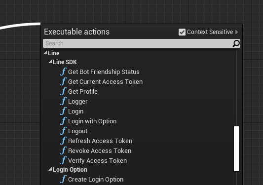 |
| -- |

## Integrating LINE Login with your Unreal Engine game

### Getting the SDK

1. In your game’s root directory, create a folder named `Plugins`.
2. Copy the [LineSDK](../Line_SDK_Unreal/Plugins/LineSDK) folder into it. You should have something like:

    ```
      MyProject
      ├── Plugins
              └── LineSDK
                  └── LineSDK.uplugin
    ```

3. In a Blueprint Project, enable the plugin by first clicking **Settings** > **Plugins**, scrolling down to Project section of plugins, and clicking **Other** > **LineSDK**. From there you can tick the Enabled checkbox:

    | 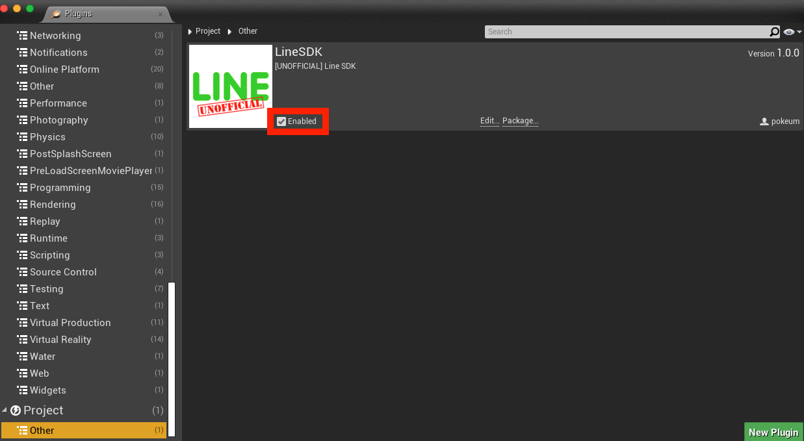 |
    | -- |


### Implement login with LINE

| Login |
| :-- |
| 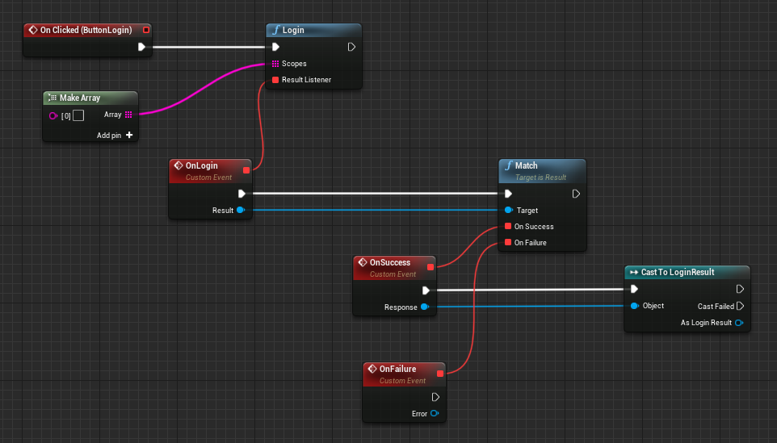 |

| Login With Option |
| :-- |
| 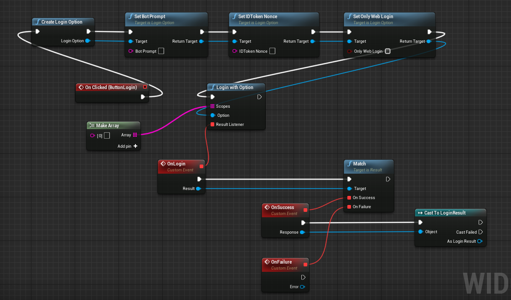 |

<br/>

## Using LINE SDK for other APIs and result handling

### Calling LINE APIs with result handling

Every LINE SDK for Unreal Engine API operation that can fail, provides a `UResult` object in the callback. By checking the Result value, you can handle both the success and failure case elegantly:

| 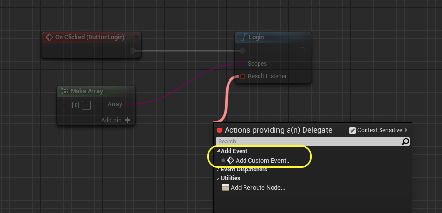 |
| -- |
| 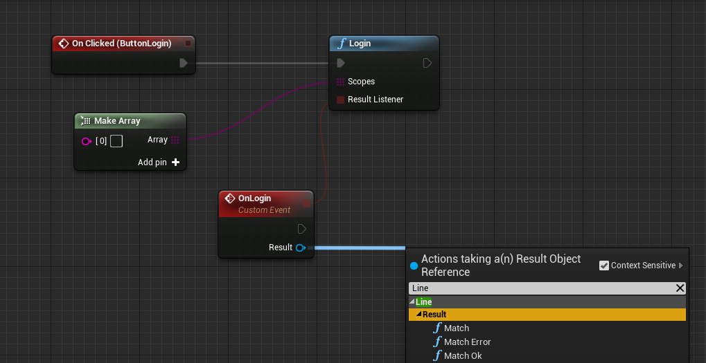 |

| Match | Match Ok | Match Error |
| -- | -- | -- |
| 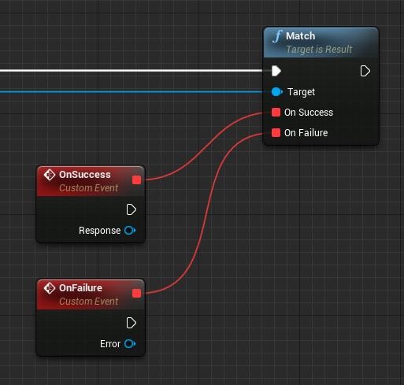 | 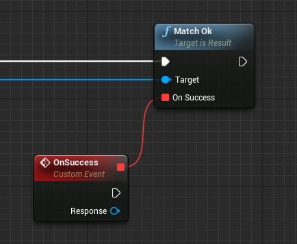 | 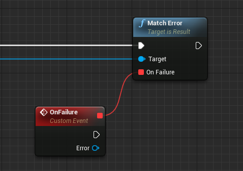 |

### Getting user profile

| 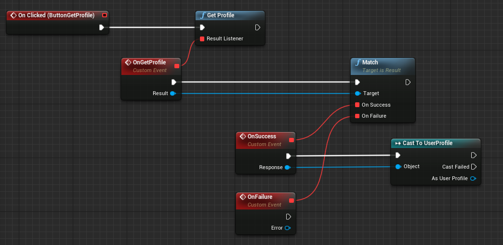 |
| -- |

### Logging out users

| 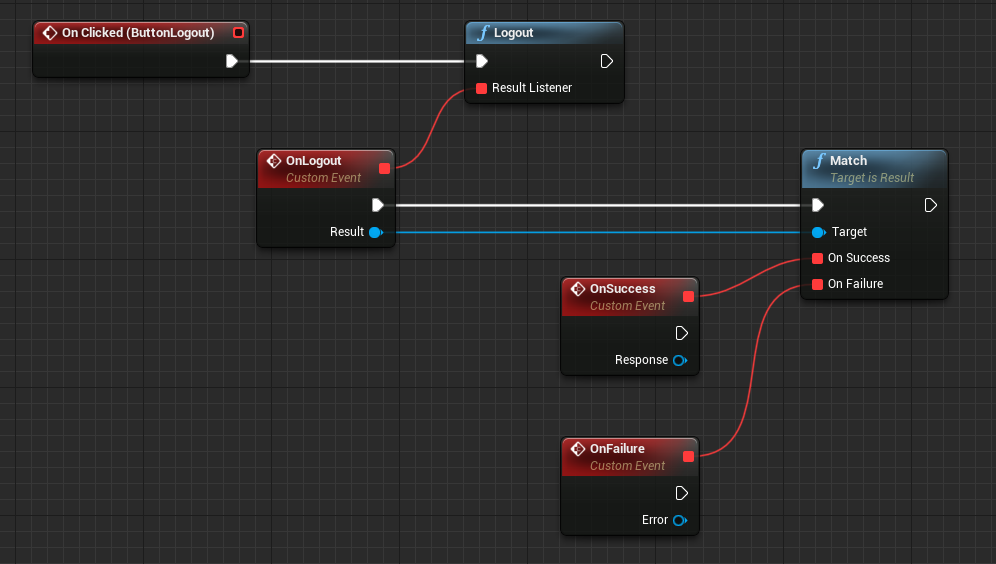 |
| -- |

### Getting access token

| 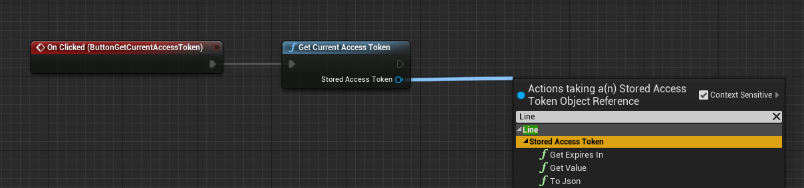 |
| -- |

### Verify and refresh access tokens

| Verify Access Token |
| :-- |
| 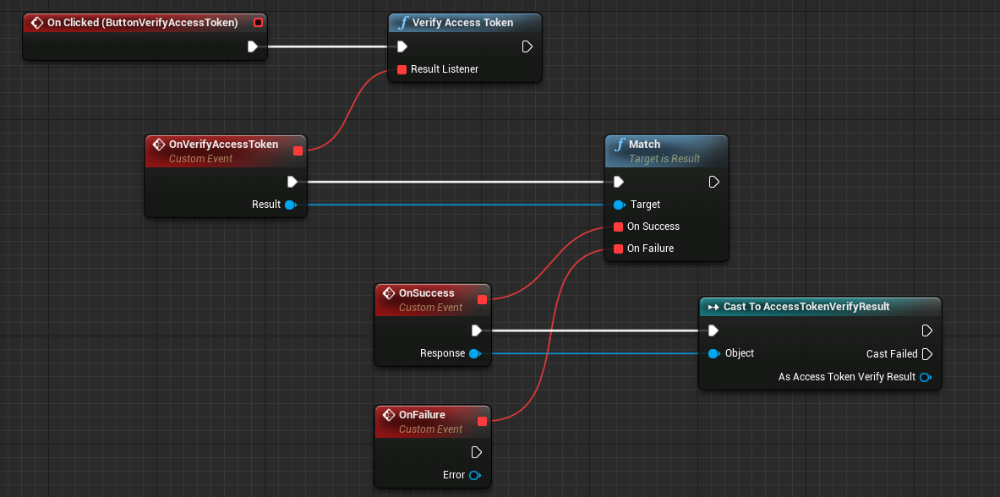 |

| Refresh Access Token |
| :-- |
| 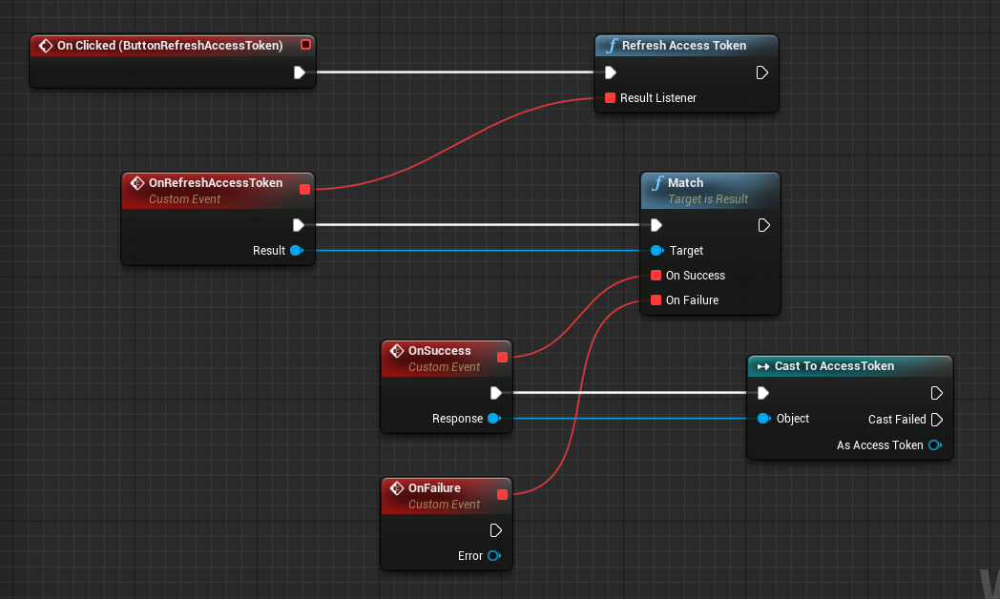 |
