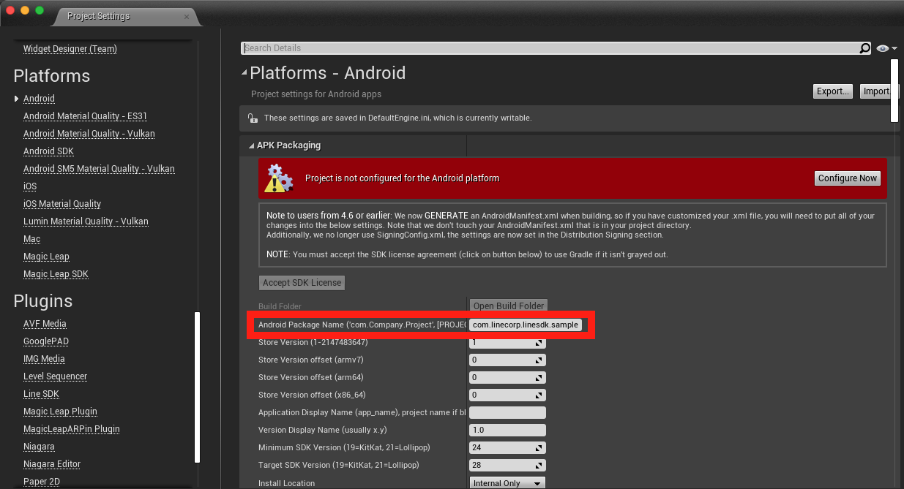
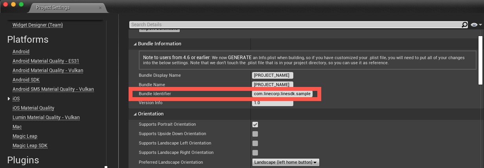

# [⚠️ UNOFFICIAL] LINE SDK for Unreal Engine

## Setting up your project

The LINE SDK for Unreal Engine provides an interface for using LINE SDK on either Android or iOS platform.
To use LINE SDK in Unreal Engine and export it to a platform, your development environment needs a few things.

### Unreal Engine requirements

* Unreal Engine `4.23` or later, with Android and iOS modules installed.

<br/>

## Trying the starter app

The LINE Login starter app for Unreal Engine lets you quickly see how LINE Login works in a Unreal Engine game.

### Trying the starter app with the predefined sample channel

To try the starter app with our sample channel, follow these steps:

1. Clone the repository.

    ```shell
    git clone https://github.com/pokeum/line-sdk-unreal
    ```
2. In Unreal Engine, open the project in the folder `Line_SDK_Unreal`.
3. Open Level Blueprint for `Content/Maps/MainMap` to change viewport widget.

    |  |
    | -- |

4. Package project to either Android or iOS, and install it to your device and run.

### Trying the starter app with your own channel

You can also link the starter app to your own channel. If you don't have a channel yet, [create one now](https://developers.line.biz/console/register/line-login/channel/). 
You'll also have to select or create a [provider](https://developers.line.biz/en/glossary/#provider).

To link the starter app with your channel, make the following changes in your Unreal Engine project:

1. Select **Project Settings**.

2. Select **Platforms** > **Android** > **APK Packaging**, and set **Android Package Name** to the same value as **Android Package Name** in the **LINE Login** tab of your LINE Login channel in the LINE Developers Console.

    |  |
    | -- |

3. Select **Platforms** > **iOS** > **Bundle Information**, and set **Bundle Identifier** to the same value as **iOS bundle ID** in the **LINE Login** tab of your LINE Login channel in the LINE Developers Console.
   
    |  |
    | -- |

4. Select **Plugins** > **Line SDK**, and enter your LINE Login channel ID in the **Channel ID** field.

    |  |
    | -- |

### Running the starter app

Run the starter app using an Android/iOS device or Simulator. When you first log in, you must agree to let the app access your profile information.

Tap **Login with LINE** to log in using app-to-app login.

If LINE is installed on the device and you are logged in, you will be able to log in to the starter app automatically without entering your LINE credentials. Otherwise, you'll be asked to log in using the browser. In the second scenario, you'll need to enter your LINE credentials.

<br/>

## Integrating LINE Login with your Unreal Engine game

After you [set up your project](#setting-up-your-project), you can start importing LINE SDK for Unreal Engine into your existing Unreal Engine game and leverage LINE Login to improve your app's user experience.

### Getting the SDK

#### Download from GitHub

```shell
git clone https://github.com/pokeum/line-sdk-unreal
```

#### Import into your project

1. In your game’s root directory, create a folder named `Plugins`.
2. Copy the [LineSDK](../Line_SDK_Unreal/Plugins/LineSDK) folder into it. You should have something like:

    ```
      MyProject
      ├── Plugins
              └── LineSDK
                  └── LineSDK.uplugin
    ```

3. If using a C++ Project, configure your module to reference the LineSDK module. In your `MyProject.Build.cs` file, add **"LineSDK"** to your PublicDependencyModuleNames. Ex:

    ```csharp
    PublicDependencyModuleNames.AddRange(new string[] { ... , "LineSDK" });
    ```

### Implement login with LINE

```cpp
#include "LineSDK.h"

const TArray<FString> Scopes = { TEXT("profile"), TEXT("openid") };
FLineSDK::Login(Scopes, 
    [&](const UResult* Result)
    {
        Result->Match(
            [&](const UResponse* Response)
            {
                const ULoginResult* LoginResult = Cast<ULoginResult>(Response);
                if (LoginResult)
                {
                    FLineSDK::Logger(FString::Printf(TEXT("Login OK. User display name: %s"),
                        *LoginResult->GetUserProfile()->GetDisplayName()));
                }
            },
            [&](const UError* Error)
            {
                FLineSDK::Logger(FString::Printf(TEXT("Login failed, reason: %s"), *Error->GetMessage()));
            }
        );
    }
);
```

LINE SDK for Unreal Engine supports only Android and iOS for now. It will always return an error if you run it in Unreal Engine In-Editor Testing mode. To test it, you need to package your project to to either an Android or iOS device.

<br/>

## Using LINE SDK for other APIs and result handling

### Calling LINE APIs with result handling

Every LINE SDK for Unreal Engine API operation that can fail, provides a `UResult` object in the callback. By checking the Result value, you can handle both the success and failure case elegantly:

```cpp
#include "LineSDK.h"

FLineSDK::Login(Scopes, 
    [&](const UResult* Result)
    {
        Result->Match(
            [&](const UResponse* Response)
            {
                const ULoginResult* LoginResult = Cast<ULoginResult>(Response);
                if (LoginResult)
                {
                    FLineSDK::Logger(TEXT("Login OK"));
                }
            },
            [&](const UError* Error)
            {
                FLineSDK::Logger(FString::Printf(TEXT("Login failed, error code: %d"), Error->GetCode()));
            }
        );
    }
);
```

In the `OnMatchedError` branch, every `UError` object contains an error `Code`. The error code will be different for each platform. Learn more on these pages:

* [Handling errors for LINE SDK for Android](https://developers.line.biz/en/docs/line-login-sdks/android-sdk/handling-errors/)
* [Handling errors for LINE SDK for iOS Swift](https://developers.line.biz/en/docs/line-login-sdks/ios-sdk/swift/error-handling/)
* [Error API reference and definition for Android](https://developers.line.biz/en/reference/android-sdk/reference/com/linecorp/linesdk/LineApiResponseCode.html)
* [Error API reference and definition for Swift](https://developers.line.biz/en/reference/ios-sdk-swift/Enums/LineSDKError.html)

### Getting user profile

If the login request is sent with the `profile` scope, you can get the user's LINE profile information. The user profile includes the user ID, display name, profile media (image or video), and status message.

Call the `FLineSDK::GetProfile` method as below:

```cpp
#include "LineSDK.h"

FLineSDK::GetProfile([&](const UResult* Result)
{
    Result->Match(
        [&](const UResponse* Response)
        {
            const UUserProfile* UserProfile = Cast<UUserProfile>(Response);
            if (UserProfile)
            {
                FLineSDK::Logger(FString::Printf(TEXT("User ID: %s"), *UserProfile->GetUserId()));
                FLineSDK::Logger(FString::Printf(TEXT("User Display Name: %s"), *UserProfile->GetDisplayName()));
                FLineSDK::Logger(FString::Printf(TEXT("User Status Message: %s"), *UserProfile->GetStatusMessage()));
                FLineSDK::Logger(FString::Printf(TEXT("User Icon: %s"), *UserProfile->GetPictureUrl()));
            }
        },
        [&](const UError* Error)
        {
            FLineSDK::Logger(Error->GetMessage());
        }
    );
});
```

### Logging out users

You can log out users from your app. To provide a better user experience, we recommend providing a way for users to log out of your app.

Call the `FLineSDK::Logout` method to invalidate a user's access token and log them out of your app. After logging out, the user must go through the login process again to log in.

```cpp
#include "LineSDK.h"

FLineSDK::Logout([&](const UResult* Result)
{
    Result->Match(
        [&](const UUnit* _) { /* User logout done. Update UI. */ },
        [&](const UError* Error)
        {
            FLineSDK::Logger(Error->GetMessage());
        }
    );
});
```

### Getting access token

Server-side code can make LINE Login API calls using access tokens. To learn more, see the [LINE Login v2.1 API reference](https://developers.line.biz/en/reference/line-login/).

Call the `FLineSDK::GetCurrentAccessToken` method to get the current access token as below:

```cpp
#include "LineSDK.h"

const UStoredAccessToken* StoredAccessToken = FLineSDK::GetCurrentAccessToken();
if (StoredAccessToken)
{
    FLineSDK::Logger(FString::Printf(TEXT("Current token value: %s"), *StoredAccessToken->GetValue()));
}
```

### Verify and refresh access tokens

`CurrentAccessToken` doesn't ensure the access token is valid, even if it returns a non-null value. The access token might already be expired or revoked. Use `FLineSDK::VerifyAccessToken` to check whether the current access token is still valid or not:

```cpp
#include "LineSDK.h"

FLineSDK::VerifyAccessToken([&](const UResult* Result)
{
    Result->Match(
        [&](const UResponse* Response)
        {
            const UAccessTokenVerifyResult* AccessTokenVerifyResult = Cast<UAccessTokenVerifyResult>(Response);
            if (AccessTokenVerifyResult)
            {
                FLineSDK::Logger(FString::Printf(TEXT("Channel Id bound to the token: %s"),
                    *AccessTokenVerifyResult->GetChannelId()));
            }
        },
        [&](const UError* Error)
        {
            FLineSDK::Logger(FString::Printf(TEXT("The token verifying failed: %s"), *Error->GetMessage()));
        }
    );
});
```

When making an API request through `LineAPI`, the LINE SDK automatically refreshes any expired access token. However, the refresh operation fails if the token has been expired for a long time. In that case, an error occurs and you need to have the user log in again.

We recommend not refreshing access tokens by yourself. It's easier and safer to let the LINE SDK automatically manage access tokens. However, you can manually refresh access tokens as below:

```cpp
#include "LineSDK.h"

FLineSDK::RefreshAccessToken([&](const UResult* Result)
{
    Result->Match(
        [&](const UResponse* Response)
        {
            const UAccessToken* AccessToken = Cast<UAccessToken>(Response);
            if (AccessToken)
            {
                FLineSDK::Logger(FString::Printf(TEXT("Token refreshed. New token: %s"), *AccessToken->GetValue()));
            }
        },
        [&](const UError* Error)
        {
            FLineSDK::Logger(FString::Printf(TEXT("Something wrong when refreshing token: %s"), *Error->GetMessage()));
        }
    );
});
```
