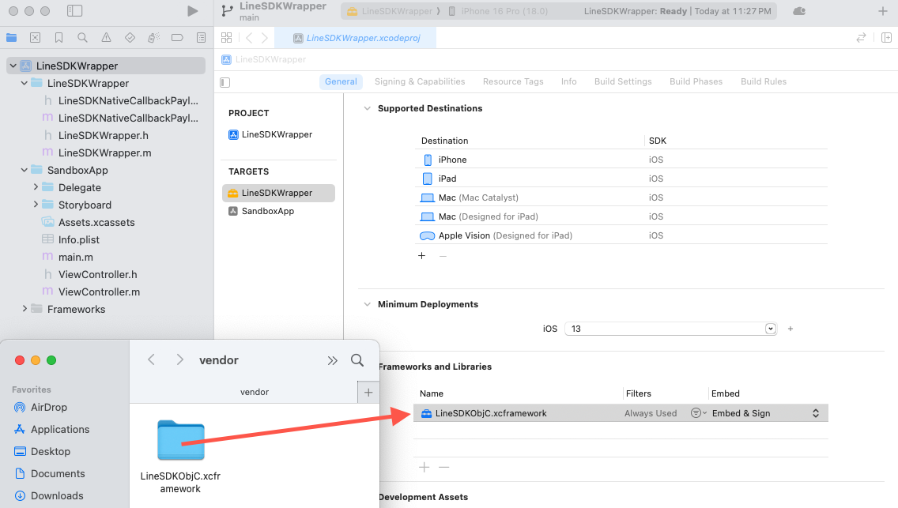
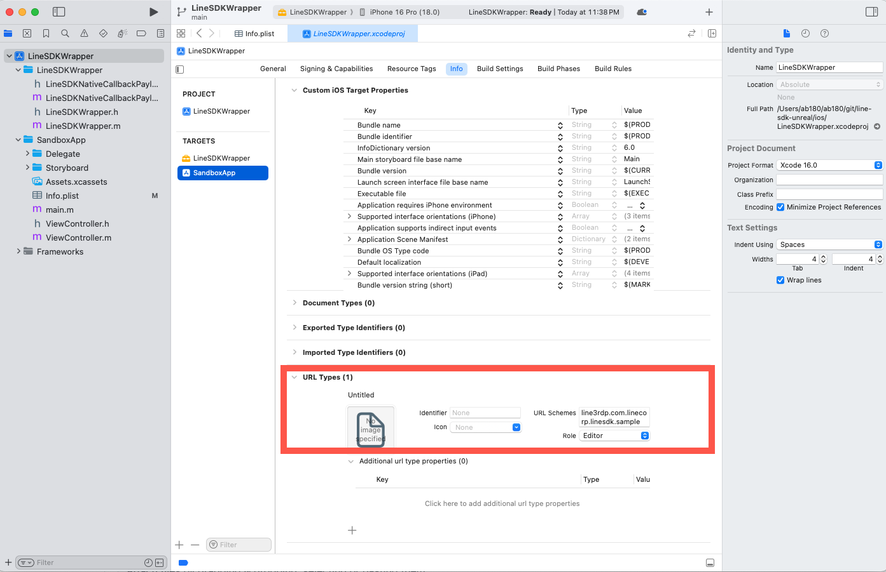
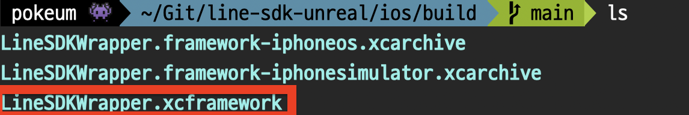

# Line SDK v5 for iOS Swift

## Installation

### Carthage

1. To install the Carthage tool, use Homebrew.
   
   ```
   brew install carthage
   ```

2. To integrate the LINE SDK for iOS Swift into your Xcode project using Carthage, specify the GitHub repository of the SDK in your Cartfile as below:

   ```
   github "line/line-sdk-ios-swift" ~> 5.0
   ```

3. Run the following command to build the LINE SDK for iOS Swift:

   ```
   carthage update line-sdk-ios-swift --use-xcframeworks
   ```

Now you can add the built `LineSDKObjC.xcframework` file to your Xcode project by following the steps described in the following sections.

<br/>

## Linking the `LineSDKObjC.xcframework` file to your Xcode project

1. Move `LineSDKObjC.xcframework` file from the `Carthage/Build` folder to the `vendor` folder.
   
2. Drag and drop the `LineSDKObjC.xcframework` file from the `vendor` folder to the "Frameworks and Libraries" section on
   LineSDKWrapper target's "General" settings tab.

   |  |
   | -- |

<br/>

## Configuring the `Info.plist` file

In Xcode, right-click your app's `Info.plist` file and select **"Open As"** > **"Source Code"**.
Insert the following snippet just before the last </dict> tag:

```xml
<key>CFBundleURLTypes</key>
<array>
    <dict>
        <key>CFBundleTypeRole</key>
        <string>Editor</string>
        <key>CFBundleURLSchemes</key>
        <array>
            <!-- Specify URL scheme to use when returning from LINE to your app. -->
            <string>line3rdp.com.linecorp.linesdk.sample</string>
        </array>
    </dict>
</array>
<key>LSApplicationQueriesSchemes</key>
<array>
    <!-- Specify URL scheme to use when launching LINE from your app. -->
    <string>lineauth2</string>
</array>
```

#### URL Scheme

- [Defining a custom URL scheme for your app](https://developer.apple.com/documentation/xcode/defining-a-custom-url-scheme-for-your-app)

   |  |
   | -- |

<br/>

## Handle the login result after your app is opened by the universal link

### Modify app delegate

```objc
#import <LineSDKWrapper/LineSDKWrapper.h>

- (BOOL)application:(UIApplication *)app openURL:(NSURL *)url options:(NSDictionary<UIApplicationOpenURLOptionsKey,id> *)options {

   return [[LineSDKWrapper sharedInstance] application:app openURL:url];
}
```

### Modify scene delegate

```objc
#import <LineSDKWrapper/LineSDKWrapper.h>

- (void)scene:(UIScene *)scene openURLContexts:(NSSet<UIOpenURLContext *> *)URLContexts {

   [[LineSDKWrapper sharedInstance] application:[UIApplication sharedApplication]
                                        openURL:URLContexts.anyObject.URL];
}
```

<br/>

## Generate `embeddedframework.zip` file

#### Start archiving your framework for the following targets:

* iOS Device
* iOS Simulator

Start with iOS Device, enter this command to terminal:

```bash
xcodebuild archive \
  -scheme LineSDKWrapper \
  -configuration Release \
  -destination 'generic/platform=iOS' \
  -archivePath './build/LineSDKWrapper.framework-iphoneos.xcarchive' \
  SKIP_INSTALL=NO \
  BUILD_LIBRARIES_FOR_DISTRIBUTION=YES
```

Next, target Simulator. Make an archive by adding this command to your terminal:

```bash
xcodebuild archive \
  -scheme LineSDKWrapper \
  -configuration Release \
  -destination 'generic/platform=iOS Simulator' \
  -archivePath './build/LineSDKWrapper.framework-iphonesimulator.xcarchive' \
  SKIP_INSTALL=NO \
  BUILD_LIBRARIES_FOR_DISTRIBUTION=YES
```

#### Generating the XCFramework

Now, make the binary framework, XCFramework. Add the following command to the terminal:

```bash
xcodebuild -create-xcframework \
  -framework './build/LineSDKWrapper.framework-iphonesimulator.xcarchive/Products/Library/Frameworks/LineSDKWrapper.framework' \
  -framework './build/LineSDKWrapper.framework-iphoneos.xcarchive/Products/Library/Frameworks/LineSDKWrapper.framework' \
  -output './build/LineSDKWrapper.xcframework'
```

#### Generating the embeddedframework.zip

|  |
| -- |

```
cd LineSDKWrapper.xcframework &&\
mkdir LineSDKWrapper.embeddedframework &&\
mv ios-arm64/LineSDKWrapper.framework LineSDKWrapper.embeddedframework/ &&\
zip -r LineSDKWrapper.embeddedframework.zip LineSDKWrapper.embeddedframework
```

### Reference

* [Create a XCFramework for iOS](https://hoangatuan.medium.com/create-a-xcframework-for-ios-986c4fc1421e) _by Tuan Hoang (Eric)_
* [Linking Swift frameworks to an Unreal Engine project](https://rassadin.net/swift-frameworks-unreal/) _by Anton Rassadin_
